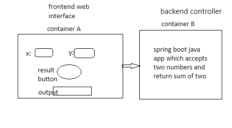

# Project Objective

- **Prerequisites**
  - Docker
  - ReactJS
  - Springboot java application
  - maven build(optional)
- **Requirement**
  - Create reactJS frontend application which accepts two integers 
    - add a result button to calcute sum of two integers
  - create spring boot java backend to calculate sum of two number
  - Containerize both application
  - When you enter two number in reactJS UI and click on result button, it will connect with BE and calculates sum of two numbers and displays result in UI.

