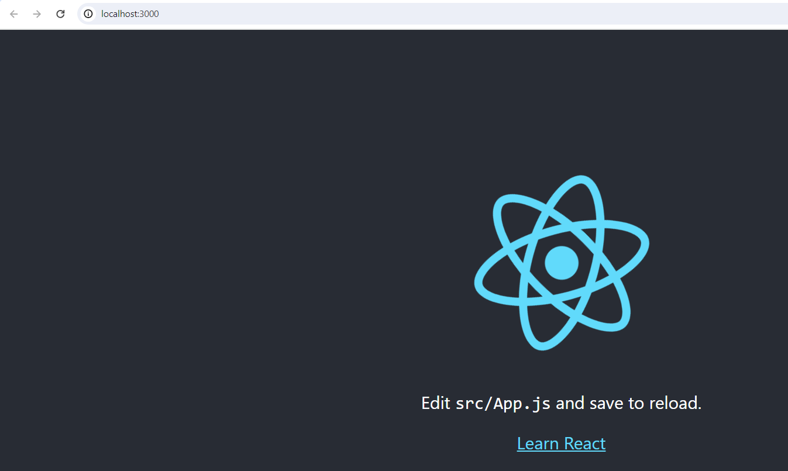

# reactJS intro

## What is React JS?

- React is a JavaScript library for building user interfaces.
- React is used to build single-page applications.
- React allows us to create reusable UI components.

## installation and sample app

- install node via [Windows installer](https://nodejs.org/en/download)
- verify - `node -v`
```text
D:\mylearning\silky_repo\GitLab\1_devops\2_be_fe_container_project\reactJS>node -v
v20.11.1
```
- install reactJS - `npm install -g create-react-app`
```text
npm install -g create-react-app
npm WARN deprecated tar@2.2.2: This version of tar is no longer supported, and will not receive security updates. Please upgrade asap.

changed 66 packages in 3s

4 packages are looking for funding
  run `npm fund` for details
```

- check react version - `create-react-app --version`
```text
create-react-app --version
5.0.1
```

- mkdir testapp and cd to it
- create reactJS app - `create-react-app sumnum`
```text
create-react-app sumnum

Creating a new React app in D:\mylearning\silky_repo\GitLab\1_devops\2_be_fe_container_project\reactJS\testapp\sumnum.

Installing packages. This might take a couple of minutes.
Installing react, react-dom, and react-scripts with cra-template...


added 1493 packages in 55s

258 packages are looking for funding
  run `npm fund` for details

Installing template dependencies using npm...

added 69 packages, and changed 1 package in 9s

262 packages are looking for funding
  run `npm fund` for details
Removing template package using npm...


removed 1 package, and audited 1562 packages in 4s

262 packages are looking for funding
  run `npm fund` for details

8 vulnerabilities (2 moderate, 6 high)

To address all issues (including breaking changes), run:
  npm audit fix --force

Run `npm audit` for details.

Success! Created sumnum at D:\mylearning\silky_repo\GitLab\1_devops\2_be_fe_container_project\reactJS\testapp\sumnum
Inside that directory, you can run several commands:

  npm start
    Starts the development server.

  npm run build
    Bundles the app into static files for production.

  npm test
    Starts the test runner.

  npm run eject
    Removes this tool and copies build dependencies, configuration files
    and scripts into the app directory. If you do this, you can’t go back!

We suggest that you begin by typing:

  cd sumnum
  npm start

Happy hacking!
```

- cd to `numsum` folder and start app using `npm start`
```text
npm start

> sumnum@0.1.0 start
> react-scripts start

(node:4676) [DEP_WEBPACK_DEV_SERVER_ON_AFTER_SETUP_MIDDLEWARE] DeprecationWarning: 'onAfterSetupMiddleware' option is deprecated. Please use the 'setupMiddlewares' option.
(Use `node --trace-deprecation ...` to show where the warning was created)
(node:4676) [DEP_WEBPACK_DEV_SERVER_ON_BEFORE_SETUP_MIDDLEWARE] DeprecationWarning: 'onBeforeSetupMiddleware' option is deprecated. Please use the 'setupMiddlewares' option.
Starting the development server...

One of your dependencies, babel-preset-react-app, is importing the
"@babel/plugin-proposal-private-property-in-object" package without
declaring it in its dependencies. This is currently working because
"@babel/plugin-proposal-private-property-in-object" is already in your
node_modules folder for unrelated reasons, but it may break at any time.

babel-preset-react-app is part of the create-react-app project, which
is not maintianed anymore. It is thus unlikely that this bug will
ever be fixed. Add "@babel/plugin-proposal-private-property-in-object" to
your devDependencies to work around this error. This will make this message
go away.
Compiled successfully!

You can now view sumnum in the browser.

  Local:            http://localhost:3000
  On Your Network:  http://192.168.56.1:3000

Note that the development build is not optimized.
To create a production build, use npm run build.

webpack compiled successfully

```

- app is accesible at `http://localhost:3000`



- modify `src/App.js` to following content
```js
import React from "react";
import ReactDOM from "react-dom/client";

function Hello(props) {
  return <h1>Hello World!</h1>;
}

const container = document.getElementById('root');
const root = ReactDOM.createRoot(container);
root.render(<Hello />);

export default Hello;
```
- verify output at `http://localhost:3000/`
