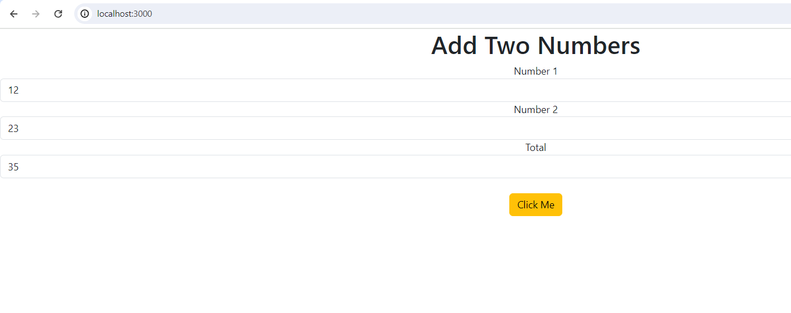

# create sum app in reactJS which accepts two numbers

- reference [link](https://www.youtube.com/watch?v=3_l7dMuaITk)

- cd `1_devops/2_be_fe_container_project/reactJS/testapp`
- create new reactJS app by running following command
```text
create-react-app displaysum
```
- install bootstrap library
```text
cd displaysum
npm -i bootstrap
```

- add new component - `1_devops/2_be_fe_container_project/reactJS/testapp/displaysum/src/components/AddNumber.js`

```js
import { useState } from "react";


function AddNumber() {

    const [num1, setNum1] = useState();
    const [num2, setNum2] = useState();
    const [tot, setTot] =  useState(); // take tot in a state


    function handleClick()
    {
        setTot(Number(num1) + Number(num2)); // set number to the state
    }

    return (
        <div>

            <h1>Add Two Numbers</h1>

            <label>Number 1</label>
            <input type="text" name="num1" class="form-control" onChange={(event) =>
            {
                setNum1(event.target.value);
            }}>
            </input>
            <label>Number 2</label>
            <input type="text" name="num2"  class="form-control" onChange={(event) =>
            {
                setNum2(event.target.value);
            }}>
            </input>
            <label>Total</label>

            <input type="text"   class="form-control" value={ tot }></input>

            <button onClick={handleClick}  class="btn btn-warning mt-4"> Click Me</button>
        </div>


    );

}
export default AddNumber;
```

- change following file - `1_devops/2_be_fe_container_project/reactJS/testapp/displaysum/src/App.js`

```js
import AddNumber from './components/AddNumber';
import "./App.css"
import 'bootstrap/dist/css/bootstrap.min.css';

function App() {


  return (
      <div className='App'>
        <AddNumber />

      </div>


  );
}

export default App;

```

- start reactJS app - `npm start`

- app will be accesible at `http://localhost:3000/` and we can enter two numbers and when we click on clickMe it will display total


