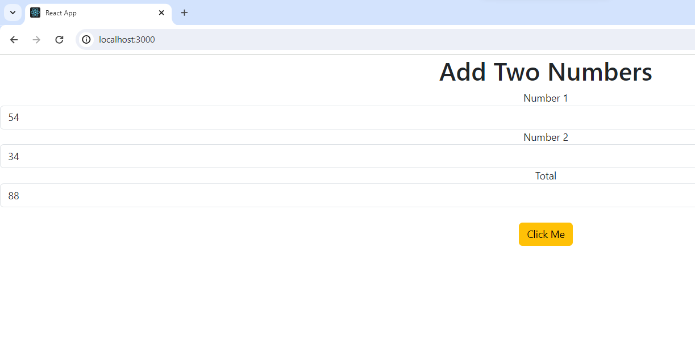

# dockerize app

- added Dockerfile as follows:
```text
FROM node:20.11.1
WORKDIR /displaysum/
COPY public/ /displaysum/public
COPY src/ /displaysum/src
COPY package.json /displaysum/
RUN npm install
RUN npm i bootstrap
CMD ["npm", "start"]
```

- build image
```text
docker image build -t displaysum:1.0 .
```

- run image
```text
docker run -dp 3000:3000 --name displaysum displaysum:1.0
```
- check for running image
```text
D:\mylearning\silky_repo\GitLab\1_devops\2_be_fe_container_project\reactJS\testapp\displaysum>docker ps
CONTAINER ID   IMAGE                        COMMAND                  CREATED          STATUS          PORTS                                       NAMES
835f06e02c74   displaysum:1.0               "docker-entrypoint.s…"   3 minutes ago    Up 3 minutes    0.0.0.0:3000->3000/tcp, :::3000->3000/tcp   displaysum
```

- access reactJS app at `http://localhost:3000/` and test

- 
